# 訊號鏈流程圖 - V3.0 版本（Mermaid）

**版本:** 3.0
**建立日期:** 2025-12-30
**更新日期:** 2025-12-30
**基於:** swiss_things_integration_plan_v2.md (V3.0)
**用途:** 視覺化訊號鏈流程 - 單功能效果器版本

---

## 目錄

1. [最終訊號鏈決策總覽 V3.0](#最終訊號鏈決策總覽-v30)
2. [V3.0 與 V2.0 關鍵差異](#v30-與-v20-關鍵差異)
3. [完整訊號鏈總覽 V3.0](#完整訊號鏈總覽-v30)
4. [場景1：Jazz Clean Tone](#場景1jazz-clean-tone)
5. [場景2：Neo Soul Rhythm](#場景2neo-soul-rhythm)
6. [場景3：Neo Soul Solo](#場景3neo-soul-solo)
7. [場景4：Post Rock Ambient Clean](#場景4post-rock-ambient-clean)
8. [場景5：Post Rock Gain Wall](#場景5post-rock-gain-wall)
9. [場景6：Classic Rock Crunch](#場景6classic-rock-crunch)
10. [場景7：實驗疊加（6顆OD全開）](#場景7實驗疊加6顆od全開)
11. [Pedalboard 物理配置圖 V3.0](#pedalboard-物理配置圖-v30)
12. [供電架構圖 V3.0](#供電架構圖-v30)

---

## 最終訊號鏈決策總覽 V3.0

### Swiss Things 整合策略：單功能效果器 + 兩組訊號鏈腳踏切換

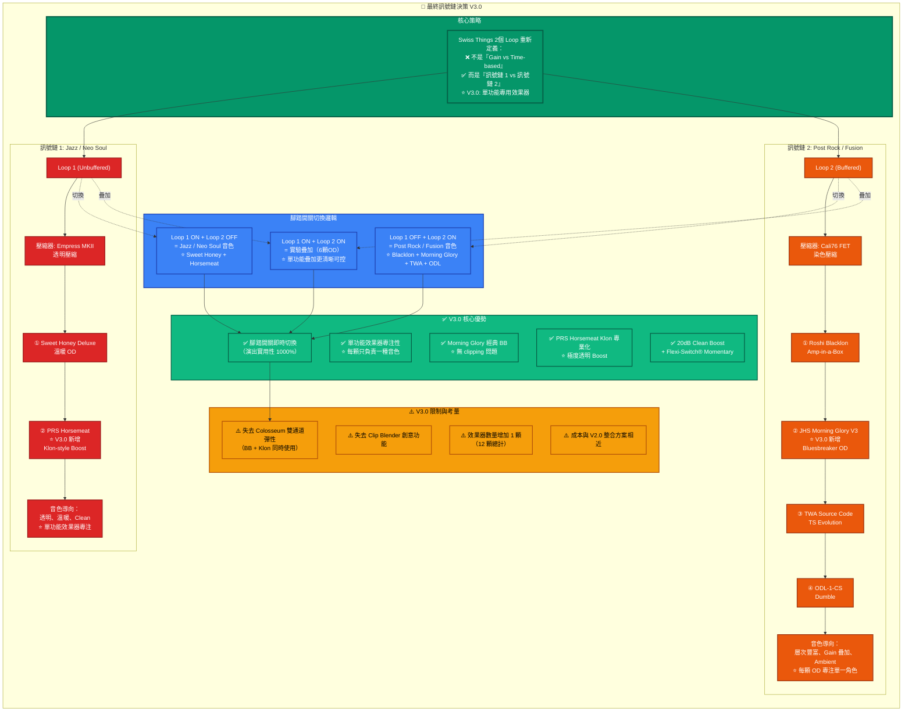

---

## V3.0 與 V2.0 關鍵差異

### 效果器變更對比

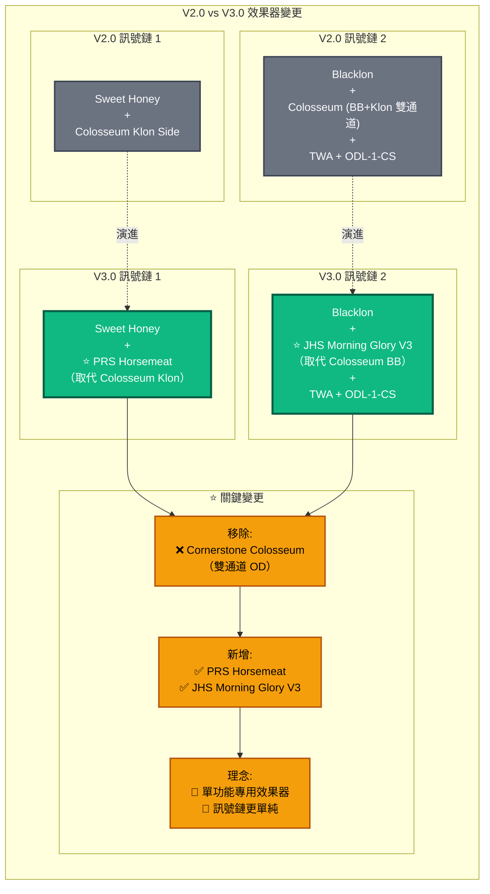

---

## 完整訊號鏈總覽 V3.0

### 方案 A：Swiss Things + Time-Based Effects（推薦）

```mermaid
flowchart TB
    subgraph Input["🎸 輸入段"]
        Guitar["🎸 Guitar"]
    end

    subgraph Comp["壓縮器選擇（手動切換）"]
        EmpressMKII["Empress MKII<br/>透明壓縮<br/>Jazz/Neo Soul"]
        Cali76["Cali76 FET<br/>染色壓縮<br/>Post Rock"]
    end

    subgraph AlwaysOn["Always-On Pedals"]
        PA1QG["Free the Tone PA-1QG<br/>10-band EQ + LEVEL<br/>Preset 1-4: 吉他專用<br/>Preset 5-8: 風格專用"]
    end

    subgraph Swiss["═══════════════════════════<br/>SWISS THINGS<br/>═══════════════════════════"]
        SwissInput["INPUT"]
        TunerOut["TUNER OUTPUT<br/>→ TC Polytune / Boss TU-3<br/>（Always-on 必須）"]

        subgraph Loop1["Loop 1 (Unbuffered)<br/>訊號鏈 1: Jazz / Neo Soul<br/>⭐ V3.0 版本"]
            Loop1Send["Loop 1 Send"]
            SweetHoney["Mad Professor<br/>Sweet Honey Deluxe<br/>溫暖 OD<br/>Drive: 11-12點鐘<br/>Focus: 1-2點鐘"]
            Horsemeat["⭐ PRS Horsemeat<br/>Klon-style Boost<br/>Drive: 9-10點鐘<br/>Volume: 2點鐘<br/>極度透明"]
            Loop1Return["Loop 1 Return"]
        end

        VolumeEXP["VOLUME EXP<br/>→ Expression Pedal<br/>（可選）"]

        subgraph Loop2["Loop 2 (Buffered)<br/>訊號鏈 2: Post Rock / Fusion<br/>⭐ V3.0 版本"]
            Loop2Send["Loop 2 Send"]
            Blacklon["Roshi Blacklon<br/>Amp-in-a-Box<br/>6L6 Mode + Drive<br/>Drive: 11-1點鐘"]
            MorningGlory["⭐ JHS Morning Glory V3<br/>Bluesbreaker OD<br/>Gain: 10-12點鐘<br/>無 clipping 問題"]
            TWA["TWA Source Code<br/>TS Evolution<br/>Bite Control<br/>Drive: 10-12點鐘"]
            ODL1CS["Free the Tone<br/>ODL-1-CS<br/>Dumble 雙通道<br/>14-16V, ROCK Mode"]
            Loop2Return["Loop 2 Return"]
        end

        Boost["BOOSTER<br/>20dB Clean Boost<br/>Solo 時使用"]
        OutputA["OUTPUT A"]
        OutputB["OUTPUT B<br/>變壓器隔離<br/>+ Phase Switch"]
    end

    subgraph TimeBased["Time-Based Effects Chain"]
        FT1Y["Free the Tone FT-1Y<br/>Realtime BPM Analyzer<br/>Delay + Hold"]
        AASB["Lichtlaerm AASB<br/>Shimmer Reverb<br/>Above/Below/Both<br/>+ Freeze"]
        Nucleo["Cornerstone Nucleo<br/>Stereo Reverb<br/>Room/Hall/Reactor<br/>+ Freeze"]
    end

    subgraph Output["🎛️ 輸出段"]
        Amp1["🎛️ Amp 1<br/>Tone King Imperial MKII<br/>或<br/>Roland JC-22"]
        Amp2["🎛️ Amp 2<br/>（雙音箱設定時）"]
    end

    %% 訊號流向
    Guitar --> EmpressMKII
    Guitar -.選擇.-> Cali76
    EmpressMKII --> PA1QG
    Cali76 --> PA1QG
    PA1QG --> SwissInput

    SwissInput --> TunerOut
    SwissInput --> Loop1Send
    Loop1Send --> SweetHoney
    SweetHoney --> Horsemeat
    Horsemeat --> Loop1Return

    Loop1Return --> VolumeEXP
    VolumeEXP --> Loop2Send

    Loop2Send --> Blacklon
    Blacklon --> MorningGlory
    MorningGlory --> TWA
    TWA --> ODL1CS
    ODL1CS --> Loop2Return

    Loop2Return --> Boost
    Boost --> OutputA
    Boost -.Both開關.-> OutputB

    OutputA --> FT1Y
    FT1Y --> AASB
    AASB --> Nucleo
    Nucleo --> Amp1

    OutputB -.雙音箱.-> Amp2

    %% 樣式
    classDef guitarStyle fill:#8B4513,stroke:#654321,stroke-width:3px,color:#fff
    classDef compStyle fill:#4169E1,stroke:#1E3A8A,stroke-width:2px,color:#fff
    classDef eqStyle fill:#9333EA,stroke:#6B21A8,stroke-width:2px,color:#fff
    classDef swissStyle fill:#059669,stroke:#065F46,stroke-width:3px,color:#fff
    classDef loop1Style fill:#DC2626,stroke:#991B1B,stroke-width:2px,color:#fff
    classDef loop2Style fill:#EA580C,stroke:#9A3412,stroke-width:2px,color:#fff
    classDef newPedalStyle fill:#10B981,stroke:#065F46,stroke-width:3px,color:#fff
    classDef timeStyle fill:#0284C7,stroke:#075985,stroke-width:2px,color:#fff
    classDef ampStyle fill:#7C3AED,stroke:#5B21B6,stroke-width:3px,color:#fff

    class Guitar guitarStyle
    class EmpressMKII,Cali76 compStyle
    class PA1QG eqStyle
    class SwissInput,TunerOut,VolumeEXP,Boost,OutputA,OutputB swissStyle
    class Loop1Send,SweetHoney,Loop1Return loop1Style
    class Horsemeat newPedalStyle
    class Loop2Send,Blacklon,TWA,ODL1CS,Loop2Return loop2Style
    class MorningGlory newPedalStyle
    class FT1Y,AASB,Nucleo timeStyle
    class Amp1,Amp2 ampStyle
```

---

## 場景1：Jazz Clean Tone

**開關狀態**: Loop 1 OFF, Loop 2 OFF, Boost OFF

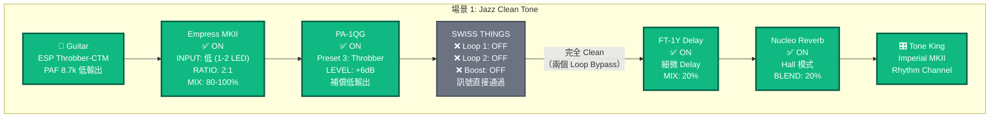

**音色特點**:

- ✅ 完全 Clean（無 OD）
- ✅ Empress MKII 提供極度透明壓縮
- ✅ PA-1QG LEVEL +6dB 補償 Throbber 低輸出
- ✅ 保留撥弦動態細節

---

## 場景2：Neo Soul Rhythm

**開關狀態**: Loop 1 ON, Loop 2 OFF, Boost OFF

```mermaid
flowchart TB
    subgraph Scene2["場景 2: Neo Soul Rhythm - V3.0"]
        Guitar2["🎸 Guitar<br/>Greco TE-500<br/>Wide Range 9.5k"]

        Empress2["Empress MKII<br/>✅ ON<br/>透明壓縮"]

        PA1QG2["PA-1QG<br/>✅ ON<br/>Preset 2: Greco<br/>LEVEL: +3dB<br/>提升 800Hz-3.2kHz"]

        subgraph SwissLoop1["SWISS THINGS"]
            direction TB
            Input2["INPUT"]

            subgraph Active1["✅ Loop 1 ON - V3.0"]
                Sweet2["Sweet Honey<br/>Drive: 11-12點鐘<br/>Focus: 1-2點鐘<br/>溫暖 Neo Soul"]
                Horse2["⭐ PRS Horsemeat<br/>Drive: 9-10點鐘<br/>Volume: 2點鐘<br/>Klon Boost<br/>透明穿透力"]
            end

            Loop2Off["❌ Loop 2 OFF<br/>（Bypass）"]
            BoostOff["❌ Boost OFF"]
            Output2["OUTPUT A"]
        end

        FT1Y2["FT-1Y Delay<br/>✅ ON<br/>BPM 同步<br/>MIX: 30%"]

        Nucleo2["Nucleo Reverb<br/>✅ ON<br/>Room 模式<br/>BLEND: 40%"]

        Amp2["🎛️ Roland JC-22<br/>Chorus ON<br/>Speed: 3-4<br/>Depth: 4-5"]
    end

    Guitar2 --> Empress2
    Empress2 --> PA1QG2
    PA1QG2 --> Input2
    Input2 --> Sweet2
    Sweet2 --> Horse2
    Horse2 --> Loop2Off
    Loop2Off --> BoostOff
    BoostOff --> Output2
    Output2 --> FT1Y2
    FT1Y2 --> Nucleo2
    Nucleo2 --> Amp2

    classDef activeStyle fill:#10B981,stroke:#065F46,stroke-width:3px,color:#fff
    classDef bypassStyle fill:#6B7280,stroke:#374151,stroke-width:2px,color:#fff
    classDef newStyle fill:#F59E0B,stroke:#B45309,stroke-width:3px,color:#000

    class Guitar2,Empress2,PA1QG2,Input2,Sweet2,FT1Y2,Nucleo2,Amp2 activeStyle
    class Horse2 newStyle
    class Loop2Off,BoostOff bypassStyle
```

**音色特點**:

- ✅ Sweet Honey 溫暖 OD（Neo Soul 甜蜜點）
- ⭐ **V3.0**: PRS Horsemeat 透明 Boost，增加中頻穿透力（取代 Colosseum Klon）
- ✅ JC-22 Chorus 增加寬度
- ✅ 中等增益，溫暖甜美

---

## 場景3：Neo Soul Solo

**開關狀態**: Loop 1 ON, Loop 2 OFF, Boost ON

```mermaid
flowchart TB
    subgraph Scene3["場景 3: Neo Soul Solo - V3.0"]
        Guitar3["🎸 Guitar<br/>Greco TE-500"]

        Empress3["Empress MKII<br/>✅ ON"]

        PA1QG3["PA-1QG<br/>✅ ON<br/>Preset 2: Greco<br/>LEVEL: +3dB"]

        subgraph SwissLoop3["SWISS THINGS"]
            direction TB
            Input3["INPUT"]

            subgraph Active3["✅ Loop 1 ON"]
                Sweet3["Sweet Honey<br/>溫暖 OD"]
                Horse3["⭐ PRS Horsemeat<br/>Klon Boost"]
            end

            Loop2Off3["❌ Loop 2 OFF"]

            BoostOn["✅ BOOST ON<br/>+15dB<br/>Solo 音量提升"]

            Output3["OUTPUT A"]
        end

        FT1Y3["FT-1Y Delay<br/>✅ ON"]

        Nucleo3["Nucleo Reverb<br/>✅ ON"]

        Amp3["🎛️ Roland JC-22"]
    end

    Guitar3 --> Empress3
    Empress3 --> PA1QG3
    PA1QG3 --> Input3
    Input3 --> Sweet3
    Sweet3 --> Horse3
    Horse3 --> Loop2Off3
    Loop2Off3 --> BoostOn
    BoostOn -- "額外 +15dB" --> Output3
    Output3 --> FT1Y3
    FT1Y3 --> Nucleo3
    Nucleo3 --> Amp3

    classDef activeStyle fill:#10B981,stroke:#065F46,stroke-width:3px,color:#fff
    classDef bypassStyle fill:#6B7280,stroke:#374151,stroke-width:2px,color:#fff
    classDef boostStyle fill:#F59E0B,stroke:#B45309,stroke-width:3px,color:#fff

    class Guitar3,Empress3,PA1QG3,Input3,Sweet3,Horse3,FT1Y3,Nucleo3,Amp3 activeStyle
    class Loop2Off3 bypassStyle
    class BoostOn boostStyle
```

**音色特點**:

- ✅ 基於 Neo Soul Rhythm 音色
- ✅ Swiss Things Boost 提供額外 +15dB Solo 音量
- ⭐ **V3.0**: Sweet Honey + Horsemeat 音色保持不變
- ✅ 音量大幅提升，Gain 維持

---

## 場景4：Post Rock Ambient Clean

**開關狀態**: Loop 1 OFF, Loop 2 OFF, Boost OFF

```mermaid
flowchart TB
    subgraph Scene4["場景 4: Post Rock Ambient Clean"]
        Guitar4["🎸 Guitar<br/>ESP EC-CTM<br/>EMG 13.5k 高輸出"]

        Cali4["Cali76 FET<br/>✅ ON<br/>染色壓縮<br/>增加 Sustain<br/>DRY: 70-80%"]

        PA1QG4["PA-1QG<br/>✅ ON<br/>Preset 1: ESP EC<br/>LEVEL: 0dB<br/>提升低頻厚度"]

        Swiss4["SWISS THINGS<br/>❌ Loop 1: OFF<br/>❌ Loop 2: OFF<br/>❌ Boost: OFF<br/>Clean 訊號通過"]

        FT1Y4["FT-1Y Delay<br/>✅ ON<br/>Hold 功能<br/>長 Delay (1/1 note)<br/>建構 Ambient Pad"]

        AASB4["AASB Shimmer<br/>✅ ON<br/>Above/Both 模式<br/>Freeze 開啟<br/>雙向八度"]

        Nucleo4["Nucleo Reverb<br/>✅ ON<br/>Reactor 模式<br/>Decay: 60-90秒<br/>Freeze 開啟<br/>核電廠空間感"]

        Amp4["🎛️ Tone King / JC-22"]
    end

    Guitar4 --> Cali4
    Cali4 --> PA1QG4
    PA1QG4 --> Swiss4
    Swiss4 -- "Clean Tone<br/>+ Cali76 Sustain" --> FT1Y4
    FT1Y4 -- "Hold 建 Pad" --> AASB4
    AASB4 -- "Freeze 層次" --> Nucleo4
    Nucleo4 --> Amp4

    classDef activeStyle fill:#10B981,stroke:#065F46,stroke-width:3px,color:#fff
    classDef bypassStyle fill:#6B7280,stroke:#374151,stroke-width:2px,color:#fff
    classDef ambientStyle fill:#06B6D4,stroke:#0E7490,stroke-width:3px,color:#fff

    class Guitar4,Cali4,PA1QG4,Amp4 activeStyle
    class Swiss4 bypassStyle
    class FT1Y4,AASB4,Nucleo4 ambientStyle
```

**音色特點**:

- ✅ Clean Tone + Cali76 Sustain
- ✅ FT-1Y Hold 建構 Ambient Pad
- ✅ AASB + Nucleo 雙 Freeze 創造天空音景
- ✅ 厚重 Pad、長 Delay、雙向八度 Shimmer

---

## 場景5：Post Rock Gain Wall

**開關狀態**: Loop 1 OFF, Loop 2 ON, Boost OFF

```mermaid
flowchart TB
    subgraph Scene5["場景 5: Post Rock Gain Wall - V3.0"]
        Guitar5["🎸 Guitar<br/>ESP EC-CTM"]

        Cali5["Cali76 FET<br/>✅ ON<br/>染色 + Sustain"]

        PA1QG5["PA-1QG<br/>✅ ON<br/>Preset 1: ESP EC<br/>LEVEL: 0dB"]

        subgraph SwissLoop5["SWISS THINGS"]
            direction TB
            Input5["INPUT"]

            Loop1Off5["❌ Loop 1 OFF"]

            subgraph Active5["✅ Loop 2 ON - V3.0<br/>4 顆 OD 疊加"]
                Blacklon5["① Roshi Blacklon<br/>6L6 + Drive<br/>Blackface 模擬"]
                Morning5["⭐ ② JHS Morning Glory V3<br/>Bluesbreaker OD<br/>經典 BB 音色<br/>無 clipping 問題"]
                TWA5["③ TWA Source Code<br/>TS Evolution<br/>中頻突出"]
                ODL5["④ ODL-1-CS<br/>Dumble<br/>14-16V ROCK"]
            end

            BoostOff5["❌ Boost OFF"]
            Output5["OUTPUT A"]
        end

        FT1Y5["FT-1Y Delay<br/>✅ ON<br/>Hold 功能"]

        AASB5["AASB Shimmer<br/>✅ ON<br/>Freeze"]

        Nucleo5["Nucleo Reverb<br/>✅ ON<br/>Reactor + Freeze"]

        Amp5["🎛️ Amp"]
    end

    Guitar5 --> Cali5
    Cali5 --> PA1QG5
    PA1QG5 --> Input5
    Input5 --> Loop1Off5
    Loop1Off5 --> Blacklon5
    Blacklon5 --> Morning5
    Morning5 --> TWA5
    TWA5 --> ODL5
    ODL5 --> BoostOff5
    BoostOff5 --> Output5
    Output5 --> FT1Y5
    FT1Y5 --> AASB5
    AASB5 --> Nucleo5
    Nucleo5 --> Amp5

    classDef activeStyle fill:#10B981,stroke:#065F46,stroke-width:3px,color:#fff
    classDef bypassStyle fill:#6B7280,stroke:#374151,stroke-width:2px,color:#fff
    classDef gainStyle fill:#DC2626,stroke:#991B1B,stroke-width:3px,color:#fff
    classDef newGainStyle fill:#F59E0B,stroke:#B45309,stroke-width:3px,color:#000
    classDef ambientStyle fill:#06B6D4,stroke:#0E7490,stroke-width:3px,color:#fff

    class Guitar5,Cali5,PA1QG5,Input5,Amp5 activeStyle
    class Loop1Off5,BoostOff5 bypassStyle
    class Blacklon5,TWA5,ODL5 gainStyle
    class Morning5 newGainStyle
    class FT1Y5,AASB5,Nucleo5 ambientStyle
```

**音色特點**:

- ⭐ **V3.0**: 4 顆 OD 層次疊加（Blacklon → Morning Glory → TWA → ODL-1-CS）
- ⭐ **V3.0**: Morning Glory 提供經典 BB 開放感，無 clipping 問題
- ✅ Cali76 FET 染色 + Sustain
- ✅ 複雜 Gain 結構 + Ambient 音景

---

## 場景6：Classic Rock Crunch

**開關狀態**: Loop 1 OFF, Loop 2 ON, Boost OFF

```mermaid
flowchart TB
    subgraph Scene6["場景 6: Classic Rock Crunch - V3.0"]
        Guitar6["🎸 Guitar<br/>Greco TE-500"]

        Cali6["Cali76 FET<br/>✅ ON"]

        PA1QG6["PA-1QG<br/>✅ ON<br/>Preset 7: Post Rock EQ<br/>提升低頻厚度"]

        subgraph SwissLoop6["SWISS THINGS"]
            direction TB
            Input6["INPUT"]

            Loop1Off6["❌ Loop 1 OFF"]

            subgraph Active6["✅ Loop 2 ON - V3.0<br/>Classic Rock 鏈"]
                Blacklon6["① Roshi Blacklon<br/>6L6 + Drive<br/>Blackface Crunch"]
                Morning6["⭐ ② JHS Morning Glory V3<br/>BB 開放感與動態"]
                TWA6["③ TWA Source Code<br/>TS 中頻突出<br/>800Hz-1.5kHz"]
            end

            BoostOff6["❌ Boost OFF"]
            Output6["OUTPUT A"]
        end

        FT1Y6["FT-1Y Delay<br/>✅ ON"]

        Nucleo6["Nucleo Reverb<br/>✅ ON<br/>Hall 模式"]

        Amp6["🎛️ Tone King<br/>Imperial MKII Lead<br/>Mid-Bite ON<br/>增加 Punch"]
    end

    Guitar6 --> Cali6
    Cali6 --> PA1QG6
    PA1QG6 --> Input6
    Input6 --> Loop1Off6
    Loop1Off6 --> Blacklon6
    Blacklon6 --> Morning6
    Morning6 --> TWA6
    TWA6 --> BoostOff6
    BoostOff6 --> Output6
    Output6 --> FT1Y6
    FT1Y6 --> Nucleo6
    Nucleo6 --> Amp6

    classDef activeStyle fill:#10B981,stroke:#065F46,stroke-width:3px,color:#fff
    classDef bypassStyle fill:#6B7280,stroke:#374151,stroke-width:2px,color:#fff
    classDef rockStyle fill:#F97316,stroke:#C2410C,stroke-width:3px,color:#fff

    class Guitar6,Cali6,PA1QG6,Input6,FT1Y6,Nucleo6,Amp6 activeStyle
    class Loop1Off6,BoostOff6 bypassStyle
    class Blacklon6,Morning6,TWA6 rockStyle
```

**音色特點**:

- ✅ Roshi Blacklon 提供 Blackface Crunch
- ⭐ **V3.0**: Morning Glory BB 增加開放感與動態
- ✅ TWA Source Code 提供 TS 特有中頻突出（800Hz-1.5kHz）
- ✅ Imperial MKII Mid-Bite 增加 Punch

---

## 場景7：實驗疊加（6顆OD全開）

**開關狀態**: Loop 1 ON, Loop 2 ON, Boost 視需求

```mermaid
flowchart TB
    subgraph Scene7["場景 7: 實驗疊加 - 6 顆 OD 全開 V3.0"]
        Guitar7["🎸 Guitar"]

        Cali7["Cali76 FET<br/>✅ ON"]

        PA1QG7["PA-1QG<br/>✅ ON"]

        subgraph SwissLoop7["SWISS THINGS<br/>⚠️ V3.0 極端 Gain 配置"]
            direction TB
            Input7["INPUT"]

            subgraph Loop1On["✅ Loop 1 ON"]
                Sweet7["① Sweet Honey"]
                Horse7["⭐ ② PRS Horsemeat<br/>Klon Boost"]
            end

            subgraph Loop2On["✅ Loop 2 ON"]
                Blacklon7["③ Roshi Blacklon"]
                Morning7["⭐ ④ JHS Morning Glory V3<br/>BB OD"]
                TWA7["⑤ TWA Source Code"]
                ODL7["⑥ ODL-1-CS"]
            end

            BoostOpt["⚠️ Boost 視需求<br/>（可能過飽和）"]
            Output7["OUTPUT A"]
        end

        FT1Y7["FT-1Y Delay<br/>✅ ON"]

        AASB7["AASB Shimmer<br/>✅ ON"]

        Nucleo7["Nucleo Reverb<br/>✅ ON"]

        Amp7["🎛️ Amp"]

        Warning["⚠️ V3.0 注意<br/>單功能效果器疊加<br/>比 V2.0 Colosseum 雙通道<br/>更清晰可控<br/><br/>適用於：<br/>• Doom Metal<br/>• Noise Rock<br/>• 實驗音樂"]
    end

    Guitar7 --> Cali7
    Cali7 --> PA1QG7
    PA1QG7 --> Input7
    Input7 --> Sweet7
    Sweet7 --> Horse7
    Horse7 --> Blacklon7
    Blacklon7 --> Morning7
    Morning7 --> TWA7
    TWA7 --> ODL7
    ODL7 --> BoostOpt
    BoostOpt --> Output7
    Output7 --> FT1Y7
    FT1Y7 --> AASB7
    AASB7 --> Nucleo7
    Nucleo7 --> Amp7
    Amp7 -.注意.-> Warning

    classDef activeStyle fill:#10B981,stroke:#065F46,stroke-width:3px,color:#fff
    classDef extremeStyle fill:#EF4444,stroke:#991B1B,stroke-width:3px,color:#fff
    classDef warningStyle fill:#FBBF24,stroke:#B45309,stroke-width:3px,color:#000

    class Guitar7,Cali7,PA1QG7,Input7,FT1Y7,AASB7,Nucleo7,Amp7 activeStyle
    class Sweet7,Horse7,Blacklon7,Morning7,TWA7,ODL7,BoostOpt extremeStyle
    class Warning warningStyle
```

**音色特點**:

- ⭐ **V3.0**: 6 顆單功能 OD 串聯（實驗性配置）
- ⭐ **V3.0**: Sweet Honey → Horsemeat → Blacklon → Morning Glory → TWA → ODL-1-CS
- ⭐ **V3.0**: 單功能效果器疊加，比 V2.0 Colosseum 雙通道更清晰可控
- ⚠️ 音色可能過於飽和，需小心控制各 OD 的 Drive 與 Volume
- ✅ 適用於 Doom Metal、Noise Rock、實驗音樂

---

## Pedalboard 物理配置圖 V3.0

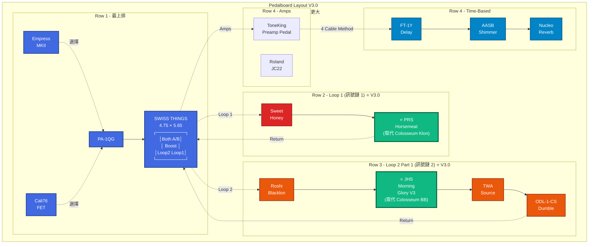

**V3.0 Pedalboard 規格**:

- **尺寸**: 32" × 16" 或更大
- **推薦型號**: Pedaltrain Terra 42 或 Temple Audio DUO 34
- **總效果器數**: 12 顆（11 顆核心 + Swiss Things）
- ⭐ **V3.0 變更**: Horsemeat 取代 Colosseum Klon, Morning Glory 取代 Colosseum BB
- **電源**: Truetone CS12 或 Strymon Zuma

---

## 供電架構圖 V3.0

```mermaid
flowchart TB
    subgraph PowerSupply["電源供應器<br/>Truetone CS12 或 Strymon Zuma"]
        direction TB

        subgraph CS12["Truetone CS12 配置 V3.0"]
            Out1["Output 1-9<br/>100mA @ 9V"]
            Out10["Output 10<br/>250mA @ 9V"]
            Out11["Output 11<br/>250mA @ 9V<br/>+ Voltage Doubler"]
            Out12["Output 12<br/>500mA @ 9V<br/>+ Voltage Doubler"]
        end

        VD["Voltage Doubler Cable<br/>9V → 12V<br/>需購買 2-3 條"]
    end

    subgraph Pedals9V["9V 效果器 V3.0（~510mA 總計）"]
        Swiss9["Swiss Things<br/>40mA"]
        Emp9["Empress MKII<br/>50mA"]
        Cal9["Cali76 FET<br/>40mA"]
        SH9["Sweet Honey<br/>20mA"]
        Horse9["⭐ PRS Horsemeat<br/>~30mA"]
        RB9["Blacklon<br/>30mA"]
        MG9["⭐ JHS Morning Glory V3<br/>~25mA"]
        TW9["TWA Source<br/>25mA"]
        AA9["AASB<br/>100mA"]
        Nu9["Nucleo<br/>150mA"]
    end

    subgraph Pedals12V["12V 效果器（630mA 總計）"]
        PA12["PA-1QG<br/>200mA @ 12V"]
        OD12["ODL-1-CS<br/>180mA @ 12V"]
        FT12["FT-1Y<br/>250mA @ 12V"]
    end

    Out1 --> Swiss9
    Out1 --> Emp9
    Out1 --> Cal9
    Out1 --> SH9
    Out1 --> Horse9
    Out1 --> RB9
    Out1 --> MG9
    Out1 --> TW9
    Out1 --> AA9

    Out10 --> Nu9

    Out11 --> VD
    VD --> FT12

    Out12 --> VD
    VD --> PA12
    VD --> OD12

    classDef powerStyle fill:#10B981,stroke:#065F46,stroke-width:2px,color:#fff
    classDef pedal9Style fill:#3B82F6,stroke:#1E40AF,stroke-width:2px,color:#fff
    classDef newPedal9Style fill:#F59E0B,stroke:#B45309,stroke-width:3px,color:#000
    classDef pedal12Style fill:#8B5CF6,stroke:#6D28D9,stroke-width:2px,color:#fff
    classDef vdStyle fill:#F59E0B,stroke:#B45309,stroke-width:2px,color:#fff

    class Out1,Out10,Out11,Out12 powerStyle
    class Swiss9,Emp9,Cal9,SH9,RB9,TW9,AA9,Nu9 pedal9Style
    class Horse9,MG9 newPedal9Style
    class PA12,OD12,FT12 pedal12Style
    class VD vdStyle
```

**V3.0 電源需求總計**:

- **9V 效果器**: ~510mA（10 顆）
  - ⭐ V3.0: -80mA (移除 Colosseum) +55mA (Horsemeat + Morning Glory)
- **12V 效果器**: 630mA（3 顆）- 無變化
- **Voltage Doubler Cable**: 需購買 2-3 條（PA-1QG, ODL-1-CS, FT-1Y）

**推薦電源供應器**:

1. **Truetone CS12** (~$200 USD) - 12 輸出，需 Voltage Doubler
2. **Strymon Zuma** (~$280 USD) - 9 輸出，原生 12V

---

## 開關狀態速查表 V3.0

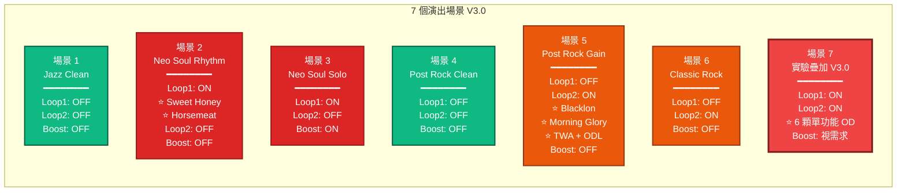

---

## V3.0 最終建議

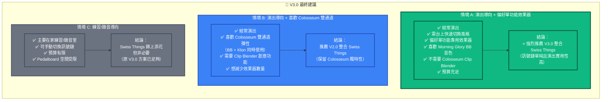

---

## 使用說明

### 如何在 Markdown 中渲染這些圖表

1. **GitHub / GitLab**: 原生支援 Mermaid，直接顯示
2. **VSCode**: 安裝 "Markdown Preview Mermaid Support" 擴充套件
3. **其他編輯器**: 使用 [Mermaid Live Editor](https://mermaid.live/) 貼上程式碼

### V3.0 圖表顏色說明

- **藍色系**: 壓縮器、EQ、Always-on pedals
- **綠色系**: Swiss Things 主體、Tuner、Boost、⭐ V3.0 新增效果器
- **紅色系**: Loop 1（訊號鏈 1 - Jazz/Neo Soul）
- **橘色系**: Loop 2（訊號鏈 2 - Post Rock）
- **黃色/金色**: ⭐ V3.0 新增效果器高亮、Boost 開啟或警告
- **青藍色系**: Time-based effects（Delay, Reverb）
- **紫色系**: 音箱
- **灰色**: Bypass/關閉的效果器

---

## V3.0 關鍵變更摘要

### 相較於 V2.0 整合方案的差異

| 項目 | V2.0 整合方案 | V3.0 整合方案 |
|------|--------------|--------------|
| **訊號鏈1 OD** | Sweet Honey + Colosseum Klon | Sweet Honey + ⭐ PRS Horsemeat |
| **訊號鏈2 OD** | Blacklon + Colosseum (BB+Klon) + TWA + ODL | Blacklon + ⭐ JHS Morning Glory + TWA + ODL |
| **效果器總數** | 11 顆（10 核心 + Swiss Things） | 12 顆（11 核心 + Swiss Things） |
| **核心理念** | 雙通道效果器（Colosseum） | ⭐ 單功能專用效果器 |
| **優勢** | Clip Blender 創意功能 | ⭐ Morning Glory 經典 BB 無 clipping |
| **劣勢** | 雙通道複雜性 | ⭐ 失去雙通道彈性 |

---

**文件完成**

此文件提供完整的 V3.0 訊號鏈 Mermaid 流程圖，包含 7 個演出場景、Pedalboard 配置圖、供電架構圖，以及開關狀態速查表。

**V3.0 特點**: 強調單功能專用效果器的優勢，PRS Horsemeat 取代 Colosseum Klon Side，JHS Morning Glory V3 取代 Colosseum BB Side，訊號鏈更單純易懂。

可直接在支援 Mermaid 的 Markdown 閱讀器中查看視覺化流程圖。🎸
